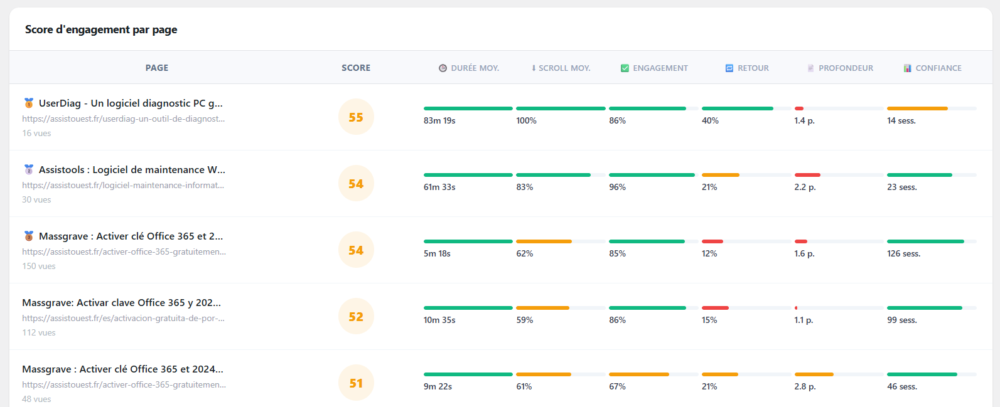

<div align="center">


# Always Analytics
### La solution d'analytics WordPress auto-hébergée qui capture 100% de vos visites et respecte la confidentialité de vos visiteurs.

🌐 [https://assistouest.fr](https://assistouest.fr/always-analytics-wordpress/)

[](https://github.com/votre-pseudo/statify/releases)
[](https://wordpress.org)
[](https://php.net)
[](#-la-révolution-privacy-first)

</div>

---

- **0% de perte de données** : Capture chaque visite, même sans consentement.
- **100% Souverain** : Vos données restent chez vous, sur votre serveur.
- **Vitesse Éclair** : Script ultra-léger sans impact sur le SEO.
- **Conformité RGPD Native** : Anonymisation et respect de la vie privée by design.


---

## Table des matières

1. [La collecte résiliente — 0% de perte](#-lalgorithme-de-collecte-résiliente)
2. [Les trois modes de tracking](#les-trois-modes-de-tracking)
3. [Ce que le tracker mesure](#-ce-que-le-tracker-mesure)
4. [Le score d'engagement Wilson](#-le-score-dengagement-wilson)
5. [Classification des sources de trafic](#-classification-des-sources-de-trafic)
6. [Tableau de bord & métriques](#-tableau-de-bord--métriques)
7. [Export & Campagnes](#-export--campagnes)
8. [Sécurité & anti-spam](#-sécurité--anti-spam)
9. [Hook développeur](#-hook-développeur)
10. [Données collectées](#données-collectées)

---

## 🔄 L'algorithme de collecte résiliente

La plupart des analytics conditionnent le tracking au consentement : pas de cookie accepté = visite perdue. Always Analytics fonctionne à l'envers.

> **Le suivi sans cookie constitue la base. Le cookie n'intervient qu'en option.**

Peu importe ce que fait le visiteur — accepter, refuser, fermer la bannière, bloquer les cookies, désactiver JS — une visite est **toujours enregistrée**. Le consentement ne décide pas *si* la visite est comptée. Il décide uniquement *si le visiteur peut être reconnu* lors de sa prochaine visite.

---

## Les trois modes de tracking

### Mode 1 — Cookieless

Aucun cookie. Aucune bannière. Démarre immédiatement.

Chaque visiteur est identifié par un hash calculé côté serveur :

```
SHA256(IP_anon + User-Agent + Accept-Language + fenêtre_temporelle)
```

La **fenêtre d'unicité** est configurable dans Réglages → Confidentialité & RGPD :

| Fenêtre | Comportement |
|---------|-------------|
| **Journalière** (défaut) | Hash stable toute la journée, change le lendemain. Détection des retours dans la journée, sans persistance long terme. |
| **Par session** | Hash lié à l'identifiant de session du navigateur. Aucune persistance entre visites. |

Les deux modes sont conformes aux recommandations CNIL pour l'analytics cookieless.

---

### Mode 2 — Cookie + Bannière RGPD

C'est le Mode 1 augmenté. Le cookieless tourne en permanence en dessous. La bannière et le cookie viennent s'ajouter par-dessus.

#### Le flux complet

```
Visiteur arrive
       │
       ▼
[Hit pre_consent envoyé immédiatement]
Hash journalier cookieless. Scroll, durée, engagement collectés.
Aucun cookie posé.
       │
       ▼
[Bannière affichée]
       │
       ├──── Accepte ──────────────────────────────────────────────────────┐
       │                                                                   │
       ├──── Refuse ────────────────────────────────────────────┐          │
       │                                                        │          │
       └──── Ferme sans répondre ───────────────────────────┐   │          │
                                                            │   │          │
                                                            ▼   ▼          │
                                              Hit pre_consent conservé     │
                                              = visite cookieless complète │
                                                                           ▼
                                                            Cookie visitorId créé (182j)
                                                            Hit complet envoyé
                                                            Pre_consent fusionné (is_superseded=1)
                                                            Identité persistante activée
```

#### Les trois issues

| Décision | Cookie posé | Hash utilisé | Rétention inter-jours | Données perdues |
|---|---|---|---|---|
| Acceptation | Oui — 182j | UUID permanent | ✓ Oui | Aucune |
| Refus | Non | Journalier cookieless | ✗ Non | Aucune |
| Fermeture sans réponse | Non | Journalier cookieless + sendBeacon | ✗ Non | Aucune |

#### Fusion sans doublon — la race condition résolue

Quand un visiteur accepte la bannière, deux hits doivent coexister sans doublon : le `pre_consent` déjà en base et le nouveau hit avec le `visitorId` permanent.

Le tracker attend explicitement la **Promise de confirmation** du hit `pre_consent` avant d'envoyer le hit complet avec le `preConsentSessionId`. Sans ce mécanisme, un utilisateur rapide (< 200 ms) aurait pu déclencher une fusion sur un hit pas encore en base et produire un doublon.

```javascript
// Attente de la confirmation serveur avant fusion
Promise.resolve(_preConsentPromise).then(function () {
    sendPost(data); // hit complet avec preConsentSessionId
});
```

Côté serveur, le hit `pre_consent` est marqué `is_superseded = 1` et rattaché au hash définitif du visiteur.

#### Cas particulier — cookie bloqué (ITP Safari, navigation privée)

Même si le visiteur accepte, son navigateur peut bloquer le cookie. Depuis v1.2.2, le JS **détecte activement** ce blocage :

```javascript
setVisitorCookie(candidate);
const persisted = getCookie(COOKIE_VID);

if (persisted) {
    return persisted;   // Cookie ok → visitorId stable
}
return null;            // Cookie bloqué → fallback cookieless automatique
```

Si `null` est retourné, le hit est envoyé sans `visitorId`. Le serveur détecte l'absence et bascule sur le hash cookieless — exactement comme le Mode 1. **Aucune visite perdue.**

---

### Mode 3 — Cookie sans bannière (développeurs)

Cookie `aa_vid` posé immédiatement, durée 395 jours. Tracking complet dès le premier chargement. Identité persistante garantie. À utiliser en environnement de développement uniquement.

---

## 📡 Ce que le tracker mesure

Le script front-end (`always-analytics-tracker.js`) est un tracker de précision constitué de quatre composants indépendants.

### 1. Hit initial

Envoyé au chargement de la page via `fetch` avec `keepalive: true`. Collecte :

- URL, titre, Post ID
- Référent d'entrée de session (voir ci-dessous)
- Paramètres UTM (`utm_source`, `utm_medium`, `utm_campaign`)
- Résolution d'écran
- `sessionId` (UUID généré côté JS, stocké en `sessionStorage`)


### 2. Scroll tracker (rAF-throttled)

Suivi de profondeur de scroll aux paliers **25 %, 50 %, 75 %, 100 %**. Les événements sont throttlés via `requestAnimationFrame` pour éviter toute surcharge. Chaque palier déclenche un hit `scroll` distinct en base.

```
scroll → rAF → checkScrollDepth() → hit envoyé si nouveau palier atteint
```

### 3. Heartbeat + temps d'engagement réel

- **Heartbeat :** premier ping à +5 s, puis toutes les 15 s.
- **Temps d'engagement :** chronomètre qui ne tourne **que quand la page est visible** (API `Page Visibility`). Mis en pause lors de chaque `visibilitychange` → `hidden`.
- **Ping final :** envoyé via `navigator.sendBeacon` à la fermeture/onglet caché pour garantir la réception même sans réponse serveur. Fallback sur `fetch` avec `keepalive: true` si Beacon n'est pas disponible.

```javascript
// Beacon prioritaire (survit à la fermeture de l'onglet)
if (navigator.sendBeacon) {
    var blob = new Blob([payload], { type: 'application/json' });
    if (navigator.sendBeacon(config.endpoint, blob)) return;
}
// Fallback fetch keepalive
fetch(config.endpoint, { method: 'POST', keepalive: true, ... });
```

### 4. Pixel noscript (visiteurs sans JavaScript)

Un pixel GIF 1×1 transparent est injecté dans une balise `<noscript>`. Il est servi par l'endpoint `GET /noscript` et enregistre un hit minimal en mode cookieless pur. Déduplication intégrée côté serveur. Les paramètres UTM présents dans l'URL sont également extraits.

---

## 📊 Le score d'engagement Wilson

La plupart des outils d'analytics affichent des classements basés sur des moyennes brutes et mathématiquement imprécises car elles ignorent la taille de l'échantillon. Sans correction, votre dashboard est pollué par des mirages statistiques : une page consultée une seule fois pendant 10 minutes sera classée au-dessus de votre guide pilier lu par 5 000 personnes.



Pour éviter l'anomalie des petits nombres, nous appliquons la **limite inférieure de l'intervalle de confiance de Wilson** :

$$S_{final} = \frac{P + \frac{z^2}{2n} - z \sqrt{\frac{P(1-P)}{n} + \frac{z^2}{4n^2}}}{1 + \frac{z^2}{n}}$$

*Où :*
- **$P$** est la performance brute (synthèse pondérée des 5 signaux ci-dessous)
- **$n$** est le nombre de sessions (taille de l'échantillon)
- **$z$** = 1,96 (intervalle de confiance à 95 %)

| Signal | Poids |
|--------|-------|
| Durée de lecture | ~24 % |
| Profondeur de scroll | ~22 % |
| Taux d'engagement | ~22 % |
| Fidélité | ~20 % |
| Profondeur de navigation | ~13 % |

Le score est **relatif à votre site** : Always Analytics calcule la médiane de vos contenus pour déterminer ce qu'est une longue lecture. Une page avec peu de données est pénalisée par l'incertitude et ne monte dans vos tops que lorsqu'elle a prouvé sa performance sur un volume significatif.

| Page | Sessions | Engag. Brut | Score Wilson | État |
| :--- | :---: | :---: | :---: | :--- |
| 🥇 **Guide Pilier : Sécurité** | 1 000 | 80% | **78.2** | ✅ Fiable |
| 🥈 **Optimisation PHP** | 500 | 75% | **71.4** | ✅ Solide |
| 🥉 **Mettre à jour Ubuntu...** | 1 | 100% | **12.5** | ⚠️ Instable |

---

## 🔍 Classification des sources de trafic

Always Analytics inclut une base de données de **68 sources connues** réparties en quatre catégories :

| Catégorie | Entrées | Exemples |
|-----------|---------|---------|
| **Social** | 30 | Twitter/X, LinkedIn, Facebook, Instagram, Reddit, Pinterest, TikTok… |
| **Search** | 19 | Google, Bing, DuckDuckGo, Ecosia, Qwant, Yahoo, Brave Search… |
| **IA** | 18 | ChatGPT, Perplexity, Claude, Gemini, Copilot, Mistral… |
| **Site** | 1 | Extensible |

Chaque source dispose d'un pattern regex, d'un label affiché et d'une couleur de marque. **L'ajout d'une nouvelle source ne nécessite aucun cache à vider** : le fichier `data/referrer-sources.php` est lu à la volée.

La **catégorie IA** permet de mesurer nativement le trafic issu des assistants conversationnels, une source de trafic émergente absente de la plupart des outils traditionnels.

---

## 📈 Tableau de bord & métriques

### Vue d'ensemble (KPIs)

- Visiteurs uniques, sessions, pages vues
- Taux de rebond & taux d'engagement
- Durée moyenne de session (temps d'engagement réel si disponible, durée brute sinon)
- Comparaison avec la période précédente

### Filtres croisés

Chaque vue supporte les filtres **device**, **pays** et **type de contenu** (post_type), combinables :

```
/overview?from=2024-01-01&to=2024-01-31&device=mobile&country=FR
```

### Vues disponibles

| Endpoint | Contenu |
|----------|---------|
| `overview` | KPIs globaux + comparaison période |
| `chart/visits` | Courbe de trafic (journalier ou horaire si today) |
| `top-pages` | Pages les plus visitées |
| `top-referrers` | Sources de trafic classées |
| `countries` | Répartition géographique avec drapeaux |
| `devices` | Mobile / Desktop / Tablet + navigateurs et OS par device |
| `visitors` | Visiteurs uniques, nouveaux vs retour |
| `recent-visitors` | Flux des dernières visites |
| `engagement` | Score Wilson, deep readers, avg scroll |
| `engagement/pages` | Score Wilson par page |
| `hit-sources` | Distribution par source de collecte (JS, cookie, pre_consent, noscript) |

### Sources de hits — transparence de collecte

La vue **hit-sources** expose la réalité de votre collecte, source par source :

| Source | Signification |
|--------|---------------|
| `js` | Hit JavaScript normal (cookieless ou cookie sans bannière) |
| `js_cookieless` | Fallback cookieless automatique (cookie bloqué par le navigateur) |
| `pre_consent` | Hit émis avant réponse à la bannière |
| `noscript` | Pixel visiteur sans JavaScript |
| `cookie` | Hit JS avec visitorId cookie actif |

Chaque source inclut une tendance temporelle (sparkline journalier ou horaire) et un taux de nouveaux visiteurs.

---


## Annotations de campagnes

Le système de campagnes permet d'annoter vos graphiques avec des événements marketing (lancements, promotions, publications) :

- **Créer** : `POST /campaigns` — body JSON `{ event_date, label, description, color }`
- **Lister** : `GET /campaigns?from=&to=` — toutes les campagnes, avec filtre optionnel par date
- **Supprimer** : `DELETE /campaigns/{id}`

Les annotations apparaissent en superposition sur le graphique de trafic pour corréler visuellement vos actions marketing avec les pics de visites.

---

## 🛡️ Sécurité & anti-spam

### Authentification des hits

Chaque hit entrant est validé par vérification d'`Origin` ou de `Referer` : l'un des deux doit correspondre au hostname du site. Les requêtes cross-origin d'autres domaines reçoivent une réponse `403`.

### Rate limiting à deux couches

Les hits (hors `ping` et `scroll`) sont soumis à deux contrôles complémentaires :

1. **Par session (cooldown 2 s)** : empêche les soumissions répétées depuis le même onglet.
2. **Par IP (60 hits / 60 s)** : protège contre le DDoS par rotation de `sessionId`, sans pénaliser les IPs partagées (VPN, NAT, réseaux d'entreprise).

### Proxy de confiance configurable

Pour les sites derrière un reverse proxy ou un load balancer, Always Analytics résout correctement l'IP réelle via `X-Forwarded-For` — **uniquement** si `REMOTE_ADDR` est lui-même dans la liste des proxies de confiance. Ce mécanisme empêche le spoofing d'en-tête par un attaquant externe.

```
Réglages → Confidentialité & RGPD → Proxies de confiance
```

### Déduplication noscript

Le pixel `<noscript>` dispose de son propre rate-limiting et d'une déduplication côté serveur pour éviter les comptages multiples en cas de retry navigateur.


---

## Données collectées

### Côté client (JavaScript)

- URL et titre de la page
- Post ID WordPress
- Référent d'entrée de session
- Paramètres UTM (`utm_source`, `utm_medium`, `utm_campaign`)
- Résolution d'écran
- `sessionId` (UUID JS, stocké en `sessionStorage`)
- `visitorId` (UUID, cookie `aa_vid` — mode cookie uniquement)
- Profondeur de scroll (paliers 25 %, 50 %, 75 %, 100 %)
- Durée de session brute
- Temps d'engagement (onglet actif uniquement)

### Côté serveur (PHP)

- IP anonymisée (3e octet masqué pour IPv4, derniers 80 bits pour IPv6)
- User-Agent → type d'appareil, navigateur, système d'exploitation
- `Accept-Language` → utilisé pour le hash cookieless uniquement
- Géolocalisation pays / région (base GeoIP embarquée, `data/ip-country.php`)
- Indicateur nouveau visiteur du jour
- Indicateur utilisateur WordPress connecté
- `hit_source` (js / cookie / pre_consent / noscript / js_cookieless)

---

## Architecture technique

```
Visiteur
  │
  ├── JavaScript activé ───────────────────────────────────────────────────┐
  │     always-analytics-tracker.js                                        │
  │     • fetch() hit initial avec keepalive                               │
  │     • rAF scroll tracker (paliers 25/50/75/100%)                       │
  │     • Heartbeat toutes les 15s (Page Visibility API)                   │
  │     • sendBeacon() ping final à la fermeture                           │
  │                                                                        │
  └── JavaScript désactivé ────────────────────────────────────────────┐   │
        <noscript>    │   │
                                                                       ▼   ▼
                                                    WP REST API — /always-analytics/v1/
                                                         │
                                                         ├── /hit          POST
                                                         ├── /noscript     GET (GIF 1×1)
                                                         ├── /overview     GET (admin)
                                                         ├── /chart/visits GET (admin)
                                                         ├── /top-pages    GET (admin)
                                                         ├── /top-referrers GET (admin)
                                                         ├── /countries    GET (admin)
                                                         ├── /devices      GET (admin)
                                                         ├── /engagement   GET (admin)
                                                         ├── /hit-sources  GET (admin)
                                                         ├── /export       GET (admin)
                                                         └── /campaigns    GET/POST/DELETE (admin)
                                                                  │
                                                                  ▼
                                                    MySQL — tables WordPress
                                                    wp_aa_hits / wp_aa_sessions / wp_aa_scroll
```

---

<div align="center">
  <p>Fait avec ❤️ par Adrien pour la communauté WordPress.</p>
  <a href="https://buymeacoffee.com/assistouest" target="_blank"></a>
</div>
